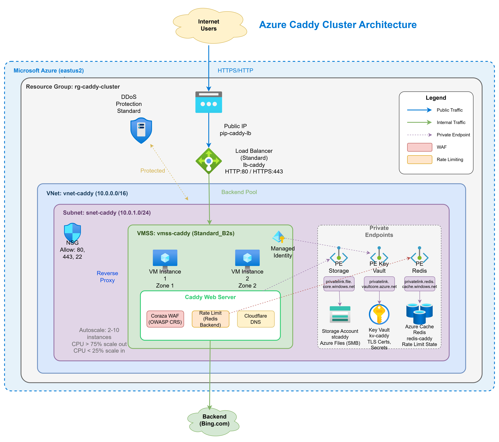

# Caddy Cluster with Azure DDoS Protection, WAF & Rate Limiting

[中文文档](README-zh.md)

Terraform-based Azure infrastructure deployment for a highly available Caddy reverse proxy cluster with integrated DDoS protection, WAF, and rate limiting capabilities.

## Architecture Overview



### Component Responsibilities

| Layer | Component | Responsibility |
|-------|-----------|----------------|
| L3/L4 | Azure DDoS Protection | Large-scale traffic scrubbing, attack mitigation |
| L4 | Standard Load Balancer | TCP load balancing, health checks |
| L7 | Caddy + Coraza WAF | TLS termination, WAF detection/blocking |
| L7 | Caddy Rate Limit | Rate limiting, anti-abuse, quota management |
| Storage | Azure Redis Cache | TLS certificate sharing across instances (optional) |
| Storage | Azure Files | WAF rules, shared configuration files |

## Directory Structure

```
lb/
├── main.tf                      # Main configuration file
├── variables.tf                 # Variable definitions
├── outputs.tf                   # Output definitions
├── terraform.tfvars.example     # Example variables file
├── modules/
│   ├── network/                 # Network module (VNet, NSG, DDoS, PIP)
│   ├── storage/                 # Storage module (Storage Account, Azure Files)
│   ├── keyvault/                # Key Vault module
│   ├── redis/                   # Redis module (optional, for certificate sharing)
│   ├── loadbalancer/            # Load balancer module
│   └── vmss/                    # VMSS module (Caddy cluster)
│       └── templates/
│           ├── cloud-init.yaml  # VM initialization script
│           ├── caddy-config.json # Caddy configuration
│           └── coraza-config.conf # WAF configuration
└── scripts/
    ├── rolling-update.sh        # Rolling update script
    ├── deploy-crs.sh            # Deploy OWASP CRS
    ├── waf-mode.sh              # WAF mode switching
    └── check-health.sh          # Health check script
```

## Quick Start

### 1. Prerequisites

```bash
# Install Terraform (>= 1.5.0)
# Install Azure CLI and login
az login
az account set --subscription <your-subscription-id>
```

### 2. Configure Variables

```bash
# Copy example configuration
cp terraform.tfvars.example terraform.tfvars

# Edit configuration
vim terraform.tfvars
```

Required variables:
- `domain_name`: Your domain name (e.g., `example.com`)
- `acme_email`: ACME certificate registration email
- `upstream_servers`: List of upstream servers
- `admin_ssh_public_key`: SSH public key (optional, auto-generated if not provided)

Optional variables:
- `rate_limit_storage_backend`: Storage backend selection (`azure_files` or `redis`, default `azure_files`)

### 3. Deploy

```bash
# Initialize
terraform init

# Preview
terraform plan

# Deploy
terraform apply
```

### 4. DNS Configuration

After deployment, point your domain to the output public IP:

```bash
# Get public IP
terraform output public_ip_address
```

## Storage Backend Configuration

### Storage Backend Selection

Caddy's storage module is used for storing TLS certificates and ACME data. Two backends are supported:

| Backend | Config Value | Description | Use Case |
|---------|--------------|-------------|----------|
| Azure Files | `azure_files` | File system storage | Default option, simple and reliable |
| Azure Redis | `redis` | Redis storage | Fast certificate sync across multiple instances |

```hcl
# terraform.tfvars
rate_limit_storage_backend = "redis"  # or "azure_files"
```

### Redis Storage Configuration

When `redis` is selected, Caddy configuration automatically uses Azure Redis Cache:

```json
{
  "storage": {
    "module": "redis",
    "host": ["redis-caddy-xxx.redis.cache.windows.net"],
    "port": ["6380"],
    "tls_enabled": true,
    "key_prefix": "caddy"
  }
}
```

**Note**: Rate Limit data is still managed in memory, with each Caddy instance counting independently. Redis is primarily used for TLS certificate sharing.

### Azure Files Shared Directory

Regardless of the storage backend chosen, Azure Files is still used for storing WAF rules.

Mount path: `/mnt/caddyshare`

```
caddyshare/
├── caddy-data/      # Certificate data (azure_files mode only)
├── waf/
│   ├── crs/         # OWASP CRS rules
│   └── custom/      # Custom WAF rules
└── releases/        # Configuration versions (for rollback)
```

## WAF Configuration

Uses the [Coraza WAF](https://coraza.io/) module with inline rules via Caddy JSON configuration.

### Currently Enabled Rules

| Rule ID | Type | Description |
|---------|------|-------------|
| 942100 | SQL Injection | Detects SQL injection attacks using `@detectSQLi` |
| 941100 | XSS Attack | Detects cross-site scripting attacks using `@detectXSS` |
| 930100 | Path Traversal | Detects `../` path traversal attempts |
| 932100 | Command Injection | Detects command injection symbols like `;` `|` `&&` |
| 913100 | Scanner Detection | Blocks scanners like sqlmap, nikto, nmap |

### Configuration Example

```json
{
  "handler": "waf",
  "directives": "SecRuleEngine On\nSecRule ARGS \"@detectSQLi\" \"id:942100,phase:2,deny,status:403,log,msg:SQL Injection\"\nSecRule ARGS \"@detectXSS\" \"id:941100,phase:2,deny,status:403,log,msg:XSS Attack\"\nSecRule REQUEST_URI \"@contains ../\" \"id:930100,phase:1,deny,status:403,log,msg:Path Traversal\"\nSecRule ARGS \"@rx (;|\\||&&)\" \"id:932100,phase:2,deny,status:403,log,msg:Command Injection\"\nSecRule REQUEST_HEADERS:User-Agent \"@rx (?i)(sqlmap|nikto|nmap)\" \"id:913100,phase:1,deny,status:403,log,msg:Scanner Detected\""
}
```

### Custom Rules

You can add custom SecRules in the `directives` string:

```
# Whitelist specific path
SecRule REQUEST_URI "@beginsWith /api/webhook" \
    "id:100001,phase:1,pass,nolog,ctl:ruleRemoveById=941100"

# Block specific User-Agent
SecRule REQUEST_HEADERS:User-Agent "@contains BadBot" \
    "id:100002,phase:1,deny,status:403,log,msg:'Blocked bad bot'"
```

### View Logs

```bash
# Caddy logs (including WAF events)
journalctl -u caddy -f
```

## Rate Limiting Configuration

Caddy configuration includes two layers of rate limiting:

| Rule | Key | Window | Limit | Description |
|------|-----|--------|-------|-------------|
| per_ip | `{remote_host}` | 1 minute | 100 requests | IP-level general limit |
| per_user | `{header.X-User-Id}` | 1 minute | 10 requests | Header-based user limit |

### Configuration Example

```json
{
  "handler": "rate_limit",
  "rate_limits": [
    {
      "key": "{remote_host}",
      "rate": "100r/m"
    },
    {
      "key": "{header.X-User-Id}",
      "rate": "10r/m"
    }
  ]
}
```

A rolling update is required after modifying rate limit parameters.

## Rolling Update

### Update Configuration

```bash
# Prepare new configuration
vim /etc/caddy/config.json

# Execute rolling update
./scripts/rolling-update.sh \
    -g rg-caddy-cluster \
    -v vmss-caddy-xxx \
    -c /etc/caddy/config.json
```

### Update WAF Rules

```bash
# Deploy new CRS version
./scripts/deploy-crs.sh -s <storage-account> -v 4.0.0

# Rolling reload
./scripts/rolling-update.sh -v <vmss-name> -c /etc/caddy/config.json
```

## Monitoring & Logging

### Log Locations

| Log | Path | Description |
|-----|------|-------------|
| Access Log | `/var/log/caddy/access.log` | HTTP request logs |
| WAF Log | `/var/log/caddy/waf.log` | WAF event logs |
| Audit Log | `/var/log/caddy/waf-audit.log` | Detailed audit logs |

### Azure Monitor

VMSS has Azure Monitor Agent installed. View in Azure Portal:
- CPU/Memory utilization
- Network traffic
- Custom metrics

## Security Recommendations

1. **Key Vault**: All sensitive information stored in Key Vault
2. **Private Endpoints**: Storage, Key Vault, Redis all use private endpoints
3. **NSG**: Only necessary ports allowed (80, 443, 22, 6380 internal)
4. **SSH Access**: SSH only accessible within VNet
5. **Admin API**: Listens only on localhost (127.0.0.1:2019)
6. **Redis TLS**: SSL port only (6380), non-SSL port disabled

## Cost Estimation

Main cost components:
- Azure DDoS Protection Standard: ~$2,944/month (optional, set `enable_ddos_protection = false` to disable)
- Standard Load Balancer: ~$18/month + data processing fees
- VMSS (2x Standard_B2s): ~$60/month
- Storage Account (ZRS): ~$2/month (100GB)
- Key Vault: ~$3/month
- Azure Redis Cache (Basic C0): ~$16/month (included for certificate sharing)

## Security Testing

Use the `scripts/test-security.sh` script to test Rate Limiting and WAF functionality:

```bash
cd scripts
./test-security.sh
```

### Test Items

| Category | Test Item | Expected Result |
|----------|-----------|-----------------|
| Connectivity | HTTPS connection | 200 OK |
| Connectivity | /health endpoint | healthy |
| Rate Limit | X-User-Id (10/min) | 11th request returns 429 |
| WAF | SQL Injection (`' OR '1'='1`) | 403 Forbidden |
| WAF | XSS (`<script>`) | 403 Forbidden |
| WAF | Path Traversal (`../`) | 403 Forbidden |
| WAF | Command Injection (`;ls`) | 403 Forbidden |
| WAF | Scanner User-Agent | 403 Forbidden |
| Normal Request | Regular browser request | 200 OK |

### Sample Output

```
━━━━━━━━━━━━━━━━━━━━━━━━━━━━━━━━━━━━━━━━━━━━━━━━━━━━━━━━━━━━━━━━━
  Test Summary
━━━━━━━━━━━━━━━━━━━━━━━━━━━━━━━━━━━━━━━━━━━━━━━━━━━━━━━━━━━━━━━━━

  Overall Results:
  ┌─────────────────────────────────────┐
  │  Total Tests:  21
  │  Passed:       18
  │  Failed:       3
  └─────────────────────────────────────┘

  ◐ Most tests passed (85%). Some issues may need attention.
```

## Troubleshooting

### Caddy Service Issues

```bash
# Check service status
systemctl status caddy

# View logs
journalctl -u caddy -f

# Validate configuration
caddy validate --config /etc/caddy/config.json
```

### Azure Files Mount Issues

```bash
# Check mount status
mount | grep caddyshare

# Remount
systemctl restart mnt-caddyshare.mount
```

### Health Check Failures

```bash
# Local test
curl -v http://127.0.0.1/health

# Batch check
./scripts/check-health.sh -v <vmss-name>
```

## License

MIT
